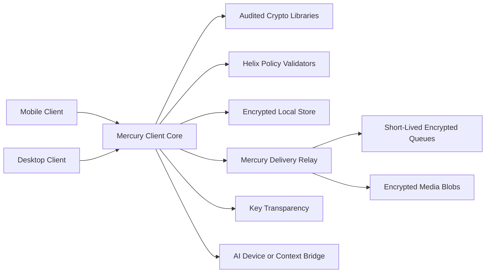

# Mercury

Mercury is a high-assurance, AI-native, end-to-end encrypted messaging platform for small-scale use first. A working **Windows desktop client ships today**, with macOS/Linux and mobile as planned targets.

The product ambition is deliberately high: Telegram-level convenience, Signal/MLS-grade cryptographic seriousness, strict metadata minimization, and explicit AI participation that never becomes a hidden plaintext backdoor. The engineering posture is conservative: use reviewed protocol libraries for cryptography, use Helix where it can already add real assurance, and grow toward stronger claims only after test vectors, audits, reproducible builds, and formal checks exist.

> **Run the live demo:** the repo now has a working end-to-end-encrypted prototype (Rust client core + relay + React UI). Two users exchange real sealed → relay → opened messages — see **[docs/RUNNING-THE-LIVE-DEMO.md](docs/RUNNING-THE-LIVE-DEMO.md)** for the relay + two app-shim + UI flow (plus a no-browser `curl` smoke test).
>
> **Install the desktop app:** the same UI now ships as a native **Tauri** desktop client that drives the real client core over in-process IPC (no open socket, keys never leave the process) and persists your identity + sessions in an OS-keychain-sealed snapshot. Build it with `npx tauri build` — see **[docs/RUNNING-THE-DESKTOP-APP.md](docs/RUNNING-THE-DESKTOP-APP.md)**. To stand up a relay for it, see **[docs/DEPLOY-THE-RELAY.md](docs/DEPLOY-THE-RELAY.md)** (PB-4).
>
> **Download site:** a static landing page (`site/`) for `mercury-messaging.com`, hosted on Cloudflare, plus CI that builds the signed Windows installer + SHA-256 as a downloadable artifact you serve from the same host — see **[docs/WEBSITE-AND-RELEASES.md](docs/WEBSITE-AND-RELEASES.md)** for the deploy + apex-domain steps.
>
> **Updates:** the in-app auto-updater is **live** — on launch the app checks a **signed** update manifest (`latest.json`) hosted at its endpoint and installs newer signed releases automatically (applied next launch); you can also re-download the installer from the site manually — see **[docs/AUTO-UPDATE.md](docs/AUTO-UPDATE.md)**.

## Current Status

Mercury has grown from its 2026-05-27 research packet into a working end-to-end system:

- **Desktop client (shipping).** A native **Tauri v2** Windows app drives the real Rust client core over in-process IPC, with identity + sessions persisted in an OS-keychain-sealed encrypted snapshot — see [docs/RUNNING-THE-DESKTOP-APP.md](docs/RUNNING-THE-DESKTOP-APP.md).
- **Relay (deployed).** `mercury-relay-server` routes opaque ciphertext only and runs at `relay.mercury-messaging.com`; one-command deploy kit in [docs/DEPLOY-THE-RELAY.md](docs/DEPLOY-THE-RELAY.md).
- **Website (live).** A static download/landing page at `mercury-messaging.com` — see [docs/WEBSITE-AND-RELEASES.md](docs/WEBSITE-AND-RELEASES.md).
- **Cryptography.** End-to-end by default: MLS-based group chat and a post-quantum hybrid 1:1 session, with audited libraries for primitives and Helix owning deterministic policy, validators, and proof artifacts.
- **AI participation.** Explicit, invited principals with scoped grants — never a hidden plaintext backdoor.
- **Helix (open source).** The deterministic policy/validator layer that Mercury mirrors security-critical decisions into is its own from-scratch language, open source at **[github.com/Questeria/helix](https://github.com/Questeria/helix)**.

**Honest boundaries today:** Windows-first (macOS/Linux/mobile planned); delivery is **real-time while Mercury is running** (foreground or minimized to the tray, via the relay's long-poll wake), but waking a **fully-quit** process — and mobile push — is still planned; installers are **Authenticode code-signed** (a SHA-256 is also published) and **auto-update** in place. The original research/planning packet is preserved below.

## Core Principles

- End-to-end encryption is the default for all user-visible messages.
- The server should route encrypted data, not read private content.
- Phone numbers should not be mandatory identifiers.
- Identity and device keys should be transparent and auditable.
- AI participants are visible principals with explicit invitations and scoped grants.
- Helix should initially own deterministic policy, validators, state-machine checks, and proof artifacts, while mature audited libraries own cryptographic primitives and ratchets.
- High-assurance claims must be earned through threat models, test vectors, fuzzing, reproducible builds, third-party audits, and formal verification where practical.

## Initial Architecture Direction



## Planning Packet

- [Research synthesis](docs/00_RESEARCH_SYNTHESIS.md)
- [Security architecture](docs/01_SECURITY_ARCHITECTURE.md)
- [AI participant model](docs/02_AI_PARTICIPANT_MODEL.md)
- [Helix integration plan](docs/03_HELIX_INTEGRATION_PLAN.md)
- [Roadmap](docs/04_ROADMAP.md)
- [Phase 1 envelope policy](docs/05_PHASE1_ENVELOPE_POLICY.md)
- [Rust policy mirror](docs/06_RUST_POLICY_MIRROR.md)
- [CI and verification](docs/07_CI_AND_VERIFICATION.md)
- [AI grant policy](docs/08_AI_GRANT_POLICY.md)
- [AI grant lifecycle policy](docs/09_AI_GRANT_LIFECYCLE_POLICY.md)
- [Room epoch policy](docs/10_ROOM_EPOCH_POLICY.md)
- [Policy pipeline](docs/11_POLICY_PIPELINE.md)
- [Rust client core policy](docs/12_RUST_CLIENT_CORE_POLICY.md)
- [Rust policy labels](docs/13_RUST_POLICY_LABELS.md)
- [Rust decision view](docs/14_RUST_DECISION_VIEW.md)
- [Client message policy input](docs/15_CLIENT_MESSAGE_POLICY_INPUT.md)
- [Client state builder](docs/16_CLIENT_STATE_BUILDER.md)
- [Local store boundary](docs/17_LOCAL_STORE_BOUNDARY.md)
- [Encrypted store adapter](docs/18_ENCRYPTED_STORE_ADAPTER.md)
- [Key hierarchy and sealing](docs/19_KEY_HIERARCHY_AND_SEALING.md)
- [Identity device trust](docs/20_IDENTITY_DEVICE_TRUST.md)
- [Key transparency proof boundary](docs/21_KEY_TRANSPARENCY_PROOF_BOUNDARY.md)
- [Room membership transitions](docs/22_ROOM_MEMBERSHIP_TRANSITIONS.md)
- [Outbound send gate](docs/23_OUTBOUND_SEND_GATE.md)
- [Relay submission policy](docs/24_RELAY_SUBMISSION_POLICY.md)
- [Relay queue contract](docs/25_RELAY_QUEUE_CONTRACT.md)
- [Delivery acknowledgement](docs/26_DELIVERY_ACKNOWLEDGEMENT.md)
- [Client receive gate](docs/27_CLIENT_RECEIVE_GATE.md)
- [Client bootstrap sync](docs/28_CLIENT_BOOTSTRAP_SYNC.md)
- [Platform binding contract](docs/29_PLATFORM_BINDING_CONTRACT.md)
- [UI integration report](docs/30_UI_INTEGRATION_REPORT.md)
- [Platform bindings and fixtures](docs/31_PLATFORM_BINDINGS_AND_FIXTURES.md)
- [UI simulation harness](docs/32_UI_SIMULATION_HARNESS.md)
- [Local encrypted store prototype](docs/33_LOCAL_ENCRYPTED_STORE_PROTOTYPE.md)
- [Relay server skeleton](docs/34_RELAY_SERVER_SKELETON.md)
- [AI participant backend skeleton](docs/35_AI_PARTICIPANT_BACKEND_SKELETON.md)
- [Preflight checks](docs/36_PREFLIGHT_CHECKS.md)
- [Crypto provider scaffolding](docs/37_CRYPTO_PROVIDER_SCAFFOLDING.md)
- [Prototype fixture coverage](docs/38_PROTOTYPE_FIXTURE_COVERAGE.md)
- [Backend session orchestration](docs/39_BACKEND_SESSION_ORCHESTRATION.md)
- [Session event transcript](docs/40_SESSION_EVENT_TRANSCRIPT.md)
- [Session event transport envelope](docs/41_SESSION_EVENT_TRANSPORT_ENVELOPE.md)
- [Backend command envelope](docs/42_BACKEND_COMMAND_ENVELOPE.md)
- [AI bridge command fixture](docs/43_AI_BRIDGE_COMMAND_FIXTURE.md)
- [Non-UI backlog ready for UI](docs/44_NON_UI_BACKLOG_READY_FOR_UI.md)
- [Durable store backend prototype](docs/45_DURABLE_STORE_BACKEND_PROTOTYPE.md)
- [Platform bridge contract](docs/46_PLATFORM_BRIDGE_CONTRACT.md)
- [Local store unlock gate](docs/47_LOCAL_STORE_UNLOCK_GATE.md)
- [Production local store open gate](docs/48_PRODUCTION_LOCAL_STORE_OPEN_GATE.md)
- [Keychain keystore adapter contract](docs/49_KEYCHAIN_KEYSTORE_ADAPTER_CONTRACT.md)
- [Production local store adapter trait](docs/50_PRODUCTION_LOCAL_STORE_ADAPTER_TRAIT.md)
- [Production store session prototype](docs/51_PRODUCTION_STORE_SESSION_PROTOTYPE.md)
- [Helix policy attestation](docs/HELIX_POLICY_ATTESTATION.md)

## Current Engineering Surface

Beyond the planning packet, the codebase now spans the full stack — the Rust client core (`mercury-core`, `mercury-client`), the app controller + Tauri desktop shell (`mercury-app`, `ui/app/src-tauri`), the delivery relay (`mercury-relay-server`), the React UI (`ui/app`), and a sealed-audit transparency engine (`mercury-audit`). Underneath, deterministic policy is mirrored across Helix, Rust, Python, JSON manifests, and test vectors:

1. Envelope validation in `helix/policy/envelope.hx`.
2. AI grant authorization in `helix/policy/ai_grant.hx`.
3. AI grant lifecycle validation in `helix/policy/ai_grant_lifecycle.hx`.
4. Room epoch and device membership validation in `helix/policy/room_epoch.hx`.
5. Policy composition in `helix/policy/policy_pipeline.hx`.
6. Relay submission validation in `helix/policy/relay_submit.hx`.
7. Rust client-core policy evaluation, checked client state builders, typed message inputs, identity/device trust and key-transparency decisions, room membership transition decisions, outbound send, relay submission, receive, and startup gating, relay queue and delivery-acknowledgement state transitions, local encrypted-store adapter, keychain/keystore adapter contract, local-store unlock and production-open gates, production local-store adapter trait and session prototype, sealing guardrails, crypto provider scaffolding, memory-only and file-backed encrypted-store prototypes, in-memory relay/server skeleton, AI participant backend skeleton, backend session orchestration, stable output labels, compact decision views, and platform binding decision views in `core/rust/mercury-core`.
8. Platform binding wrappers, checked UI/prototype fixture payloads, a strict platform bridge request/response contract, and a non-visual UI simulator in `core/rust/mercury-bindings`, `fixtures/platform`, and `fixtures/prototypes`.
9. Mercury-local Helix checks in `tools/run_helix_checks.ps1`, generated policy attestation in `helix/policy/attestation.json`, optional from-raw K1 cross-check in `tools/run_native_helix_checks.ps1`, and full local preflight in `tools/run_preflight.ps1`.

Current local check bundle:

```powershell
python .\tools\check_policy_contract.py
python .\tools\check_envelope_vectors.py
python .\tools\check_ai_grant_vectors.py
python .\tools\check_ai_grant_lifecycle_vectors.py
python .\tools\check_room_epoch_vectors.py
python .\tools\check_policy_pipeline_vectors.py
python .\tools\check_relay_submit_vectors.py
python .\tools\gen_policy_attestations.py --check
cargo check --workspace
powershell -ExecutionPolicy Bypass -File .\tools\run_helix_checks.ps1
```

Optional from-raw Helix cross-check, read-only on `C:\Projects\Kovostov-Native`:

```powershell
powershell -ExecutionPolicy Bypass -File .\tools\run_native_helix_checks.ps1
```

Full local preflight:

```powershell
powershell -ExecutionPolicy Bypass -File .\tools\run_preflight.ps1
```

## License

Mercury is **source-available under the [PolyForm Noncommercial License 1.0.0](LICENSE)**. You may read, build, run, modify, and share it for any **noncommercial** purpose — including independently rebuilding it to verify that an official release matches this source. Independent security review is welcome.

**Commercial use or monetization of Mercury — or of any modified version — requires a separate commercial license.** It is not granted here; contact the copyright holder for written permission.

This is *source-available (noncommercial)*, which is deliberately **not** the same as OSI "open source" (that definition does not permit a no-commercial-use restriction) — we describe it accurately. Third-party dependencies remain under their own licenses; see [THIRD-PARTY-NOTICES.md](THIRD-PARTY-NOTICES.md).
